

# I ❤ Logs

---

---

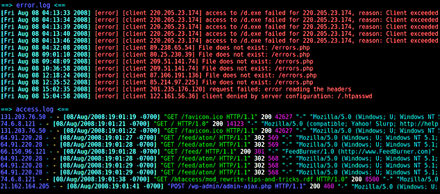

---

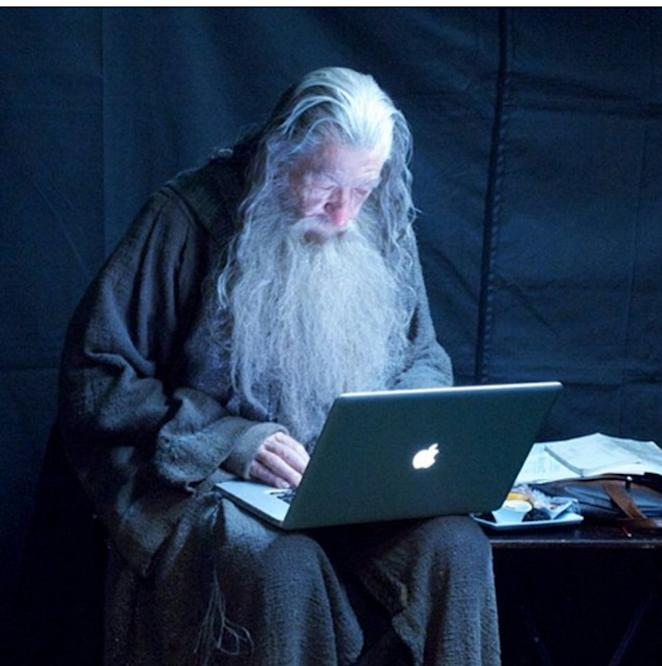{.fragment .fade-down}

---

<!-- .slide: data-background="#dddddd" -->

More than 60 applications 

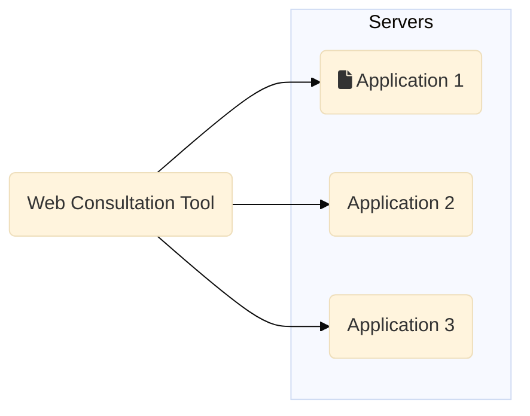

---

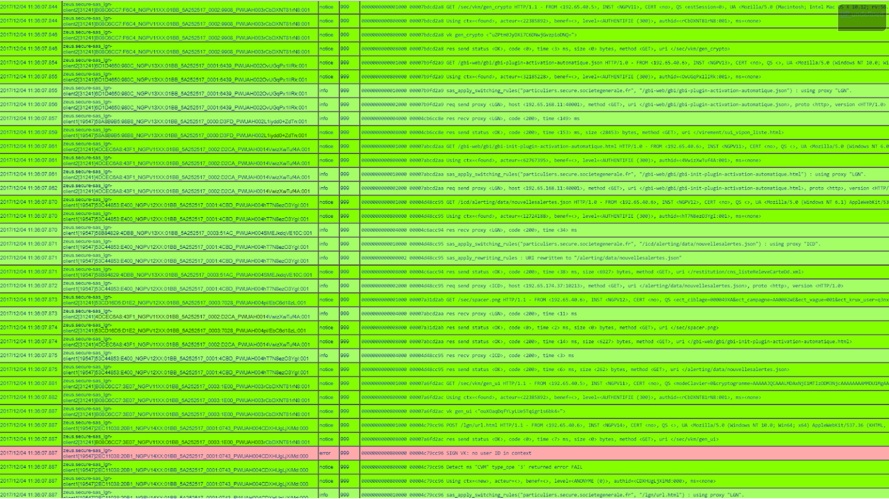

---

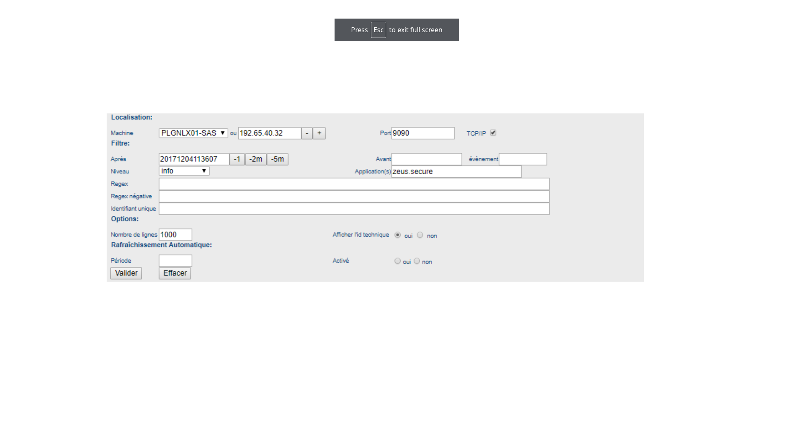

---

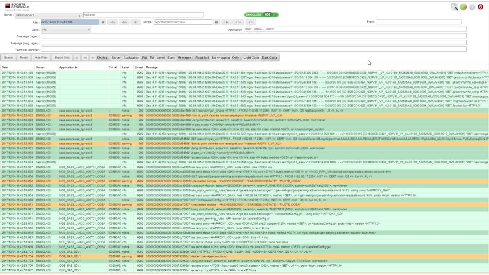

---

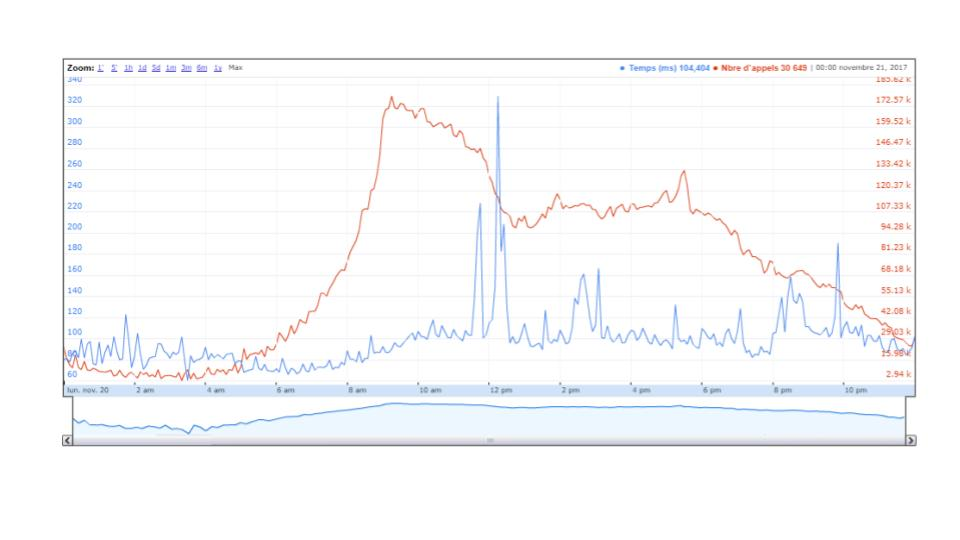

---

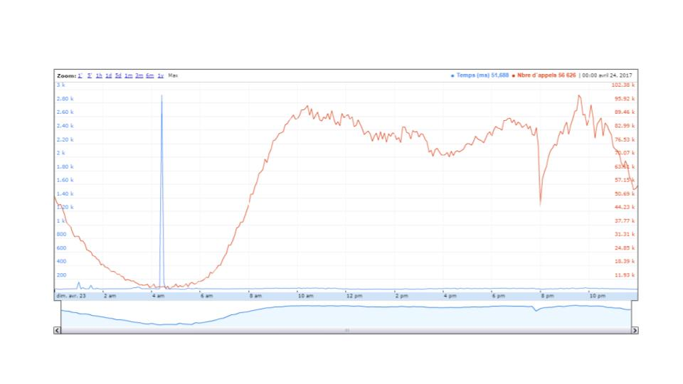

---

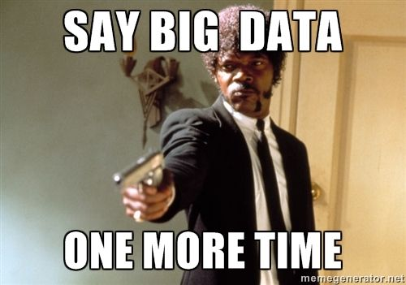

---

<!-- .slide: data-background="#dddddd" -->

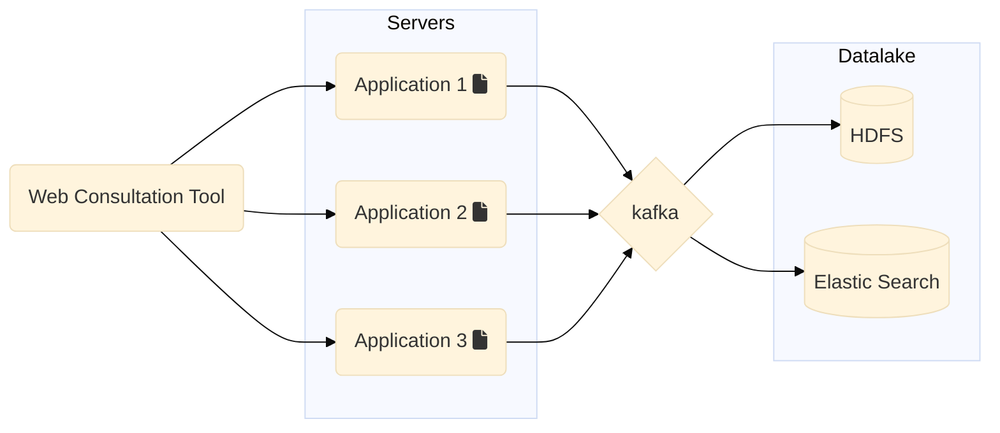

---

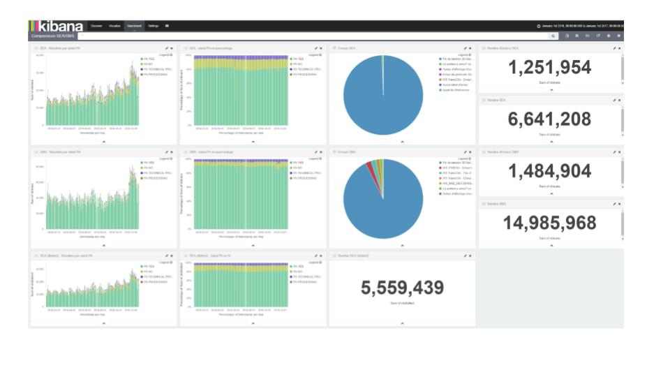

---

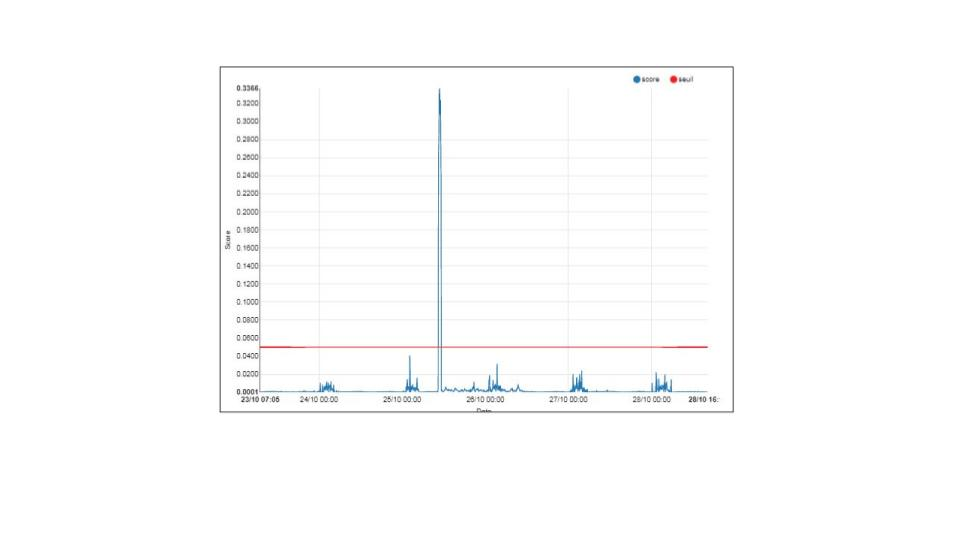

---

## Opentelemetry

https://opentelemetry.io/docs/

---

## Logs

I, [2021-02-23T13:26:23.505892 #22473]  INFO -- : [6459ffe1-ea53-4044-aaa3-bf902868f730] Started GET "/" 

---

## Span

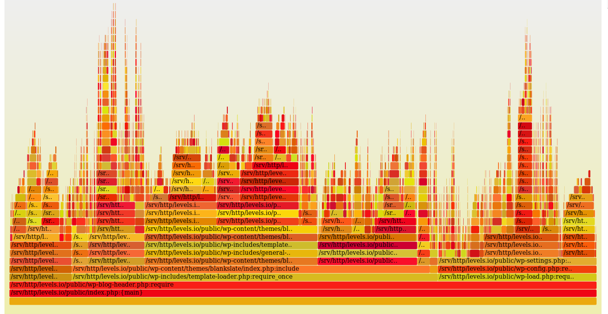

---

## Metrics

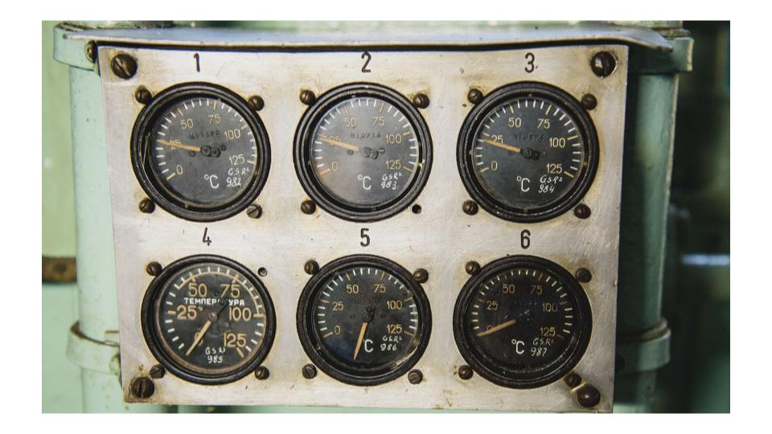

---

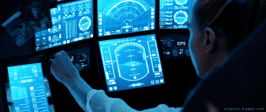

---

# TD

---

## TD 
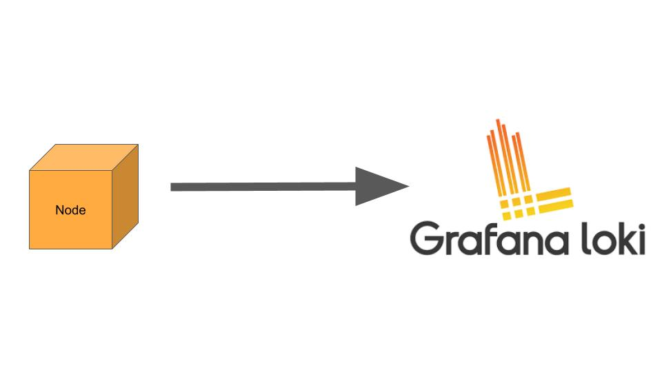

---

## TD 
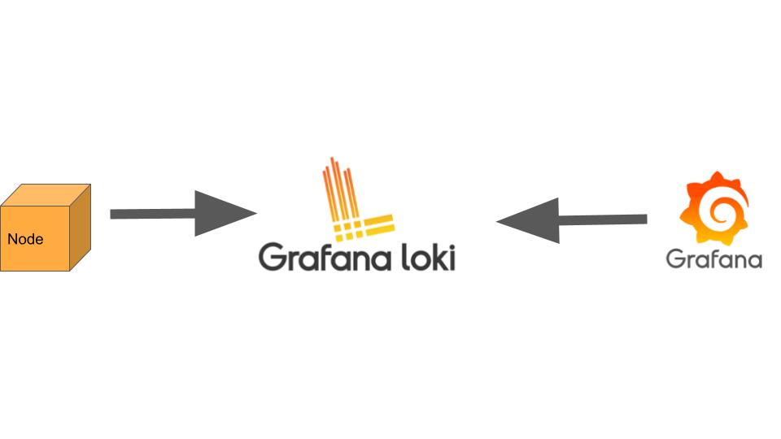

---

## TD 
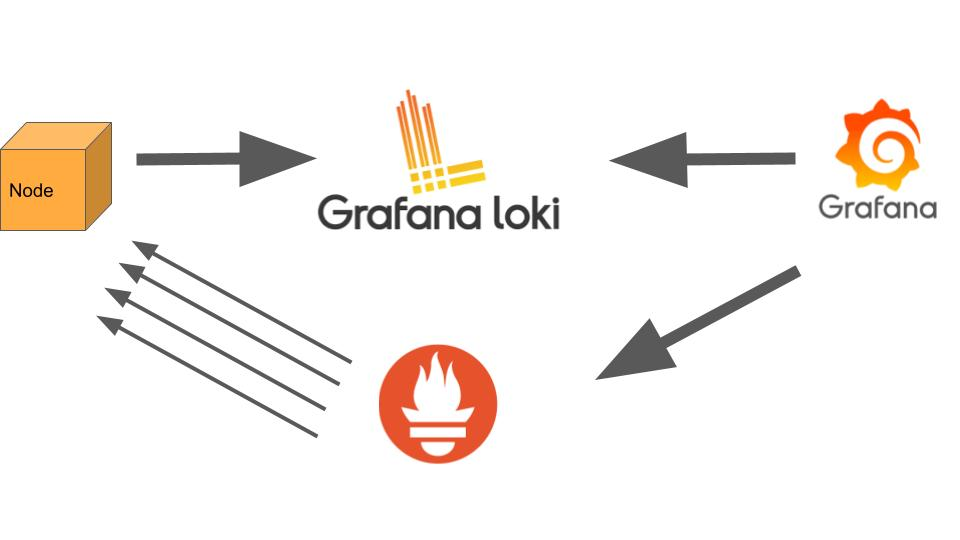

---

# TD
https://simongomezuniv.github.io/td_monitoring