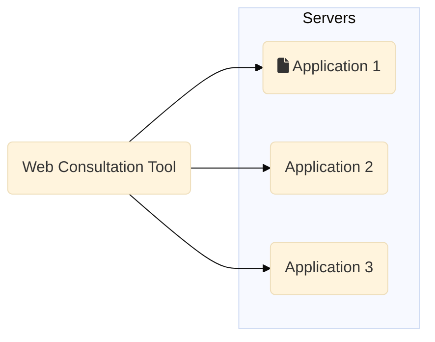

# I ❤ Logs

---

---

---

{.fragment .fade-down}

---

<!-- .slide: data-background="#dddddd" -->

More than 60 applications 

```mermaid
%%{init: {'theme': 'base', "flowchart" : { "curve" : "basis" } } }%%
flowchart LR
    outil(Web Consultation Tool)
    outil-->app1
    outil-->app2
    outil-->app3
    subgraph Servers
    app1(fa:fa-file Application 1)
    app2(Application 2)
    app3(Application 3)
    end

```

---

---

---
