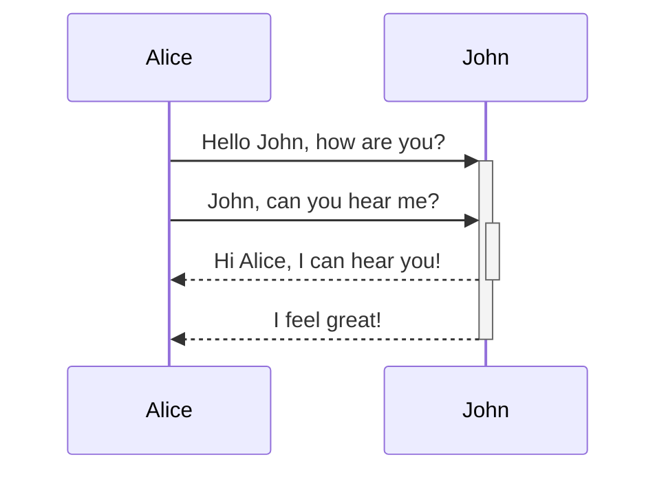

# titre de ce test

# premiere partie
## sous section
# deuxieme partie
> code
edited with nano

Here is a simple flow chart:

```mermaid
sequenceDiagram
    Alice->>+John: Hello John, how are you?
    Alice->>+John: John, can you hear me?
    John-->>-Alice: Hi Alice, I can hear you!
    John-->>-Alice: I feel great!
```
            
